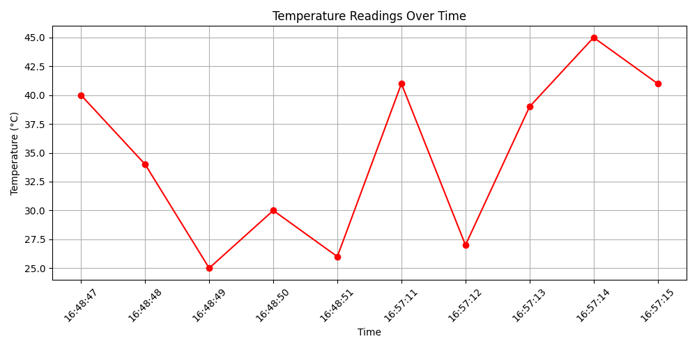
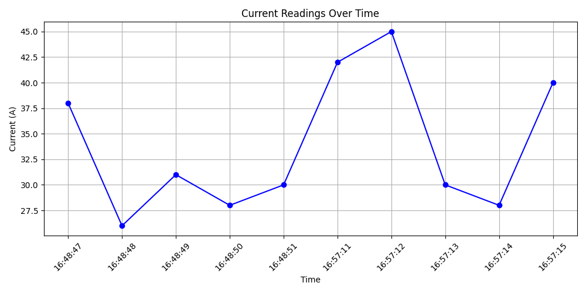

# Sensor Blackbox Logger

A Python project that simulates and logs sensor data like a blackbox system for hardware devices.

---

## Features

- Simulates **Temperature** and **Current** sensors
- Logs all readings to `data_log.csv`
- Logs critical readings to `events_log.csv`
- Plots time vs sensor values with Matplotlib
- Saves graphs as `temp_graph.png` and `current_graph.png`

---

## Sample Output

Temperature Graph  

Current Graph  

---

## How It Works

1. Runs a sensor simulator using Python classes
2. Generates random temperature/current readings
3. Flags readings above thresholds as "CRITICAL"
4. Saves logs + graphs for analysis or real-time use

# Run main simulation
python main.py

# Plot temperature
python plot_temperature.py

# Plot current
python plot_current.py

---

## Future Extensions

- Replace random values with **Arduino sensor data via pySerial**
- Trigger alerts using **email, SMS, or IFTTT**
- Add a **GUI** using Tkinter or web interface with Flask

---

## Author

Made by Sashwath Narayanan

